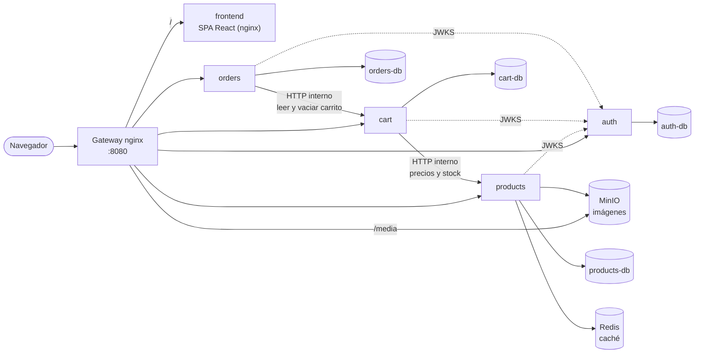
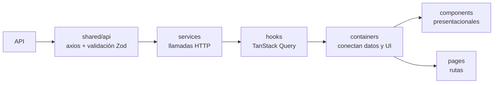

# Marketplace — Prueba técnica Full-Stack Senior

Marketplace de e-commerce con **microservicios en Django REST Framework** detrás de un
**gateway nginx** y una **SPA en React 19**. Incluye la tienda para clientes (catálogo,
carrito y órdenes) y un panel de administración para gestionar productos, categorías,
órdenes y usuarios.

## Contenido

- [Funcionalidades](#funcionalidades)
- [Stack tecnológico](#stack-tecnológico)
- [Arquitectura](#arquitectura)
- [Estructura del repositorio](#estructura-del-repositorio)
- [Instalación](#instalación)
- [Configuración](#configuración)
- [Tests y calidad](#tests-y-calidad)
- [Comandos útiles](#comandos-útiles)
- [Solución de problemas](#solución-de-problemas)
- [Notas](#notas)

## Funcionalidades

**Tienda (clientes)**

- Catálogo con búsqueda en el servidor, filtros por categoría y rango de precio, y paginación.
- Detalle de producto con galería de imágenes.
- Registro e inicio de sesión (sin verificación de email).
- Carrito por usuario: panel lateral y página de detalle, con cantidades, subtotal y
  productos que dejaron de estar disponibles.
- Generación de la orden desde el carrito (sin pago), con mensaje de éxito y número de orden.
- "Mis órdenes": listado y detalle de las compras del usuario.

**Panel de administración (`/admin`)**

| Módulo | Qué permite | Roles |
|---|---|---|
| Productos | Crear, editar, eliminar y ver detalle; subir imágenes; SKU generado automáticamente | admin, super admin |
| Categorías | Crear, editar y eliminar (no se elimina una categoría con productos) | admin, super admin |
| Órdenes | Listar, buscar por email o número de orden, filtrar por fecha y ver el detalle | admin, super admin |
| Usuarios | Crear, editar (rol, estado, contraseña) y eliminar cuentas | solo super admin |

Todas las tablas comparten el mismo componente: buscador y filtros fijos arriba, scroll
dentro de la tabla, orden y paginación resueltos en el servidor, y el estado guardado
en la URL.

## Stack tecnológico

| Capa | Tecnologías |
|---|---|
| Backend | Python 3.13, Django 5, Django REST Framework, drf-spectacular (OpenAPI), gunicorn |
| Datos | PostgreSQL (una base por servicio), Redis (caché del catálogo), MinIO (imágenes, API S3) |
| Infraestructura | nginx (gateway y frontend), Docker Compose |
| Frontend | React 19, TypeScript, Vite, Bun, Tailwind CSS v4, shadcn/ui sobre Base UI |
| Estado y datos | TanStack Query, TanStack Table v9, Zustand, nuqs (estado en la URL), axios |
| Formularios | React Hook Form + Zod |
| Tests | pytest (backend), Vitest + Testing Library (frontend), oxlint |

## Arquitectura

### Vista general



| Servicio | Responsabilidad |
|---|---|
| **gateway** | Único punto de entrada expuesto (puerto 8080). Enruta por prefijo: `/api/...` a cada servicio, `/media/` a las imágenes y todo lo demás a la app de React. Aplica rate limiting. |
| **frontend** | La SPA de React ya compilada, servida por su propio nginx y solo accesible a través del gateway. |
| **auth** | Usuarios, roles (`user`, `admin`, `super_admin`) y emisión de JWT firmados con RS256. Publica su clave pública (JWKS). |
| **products** | Catálogo, categorías e imágenes. Caché del catálogo en Redis e imágenes en MinIO. |
| **cart** | Un carrito por usuario. Consulta precio y stock en vivo al servicio de productos. |
| **orders** | Genera la orden a partir del carrito, guarda una copia de precios, nombres e imágenes y vacía el carrito. |

### Decisiones principales

- **Una base de datos por servicio**, cada una en su propia red interna de Docker:
  ningún servicio (ni el gateway) puede leer la base de otro.
- **El gateway es el único contenedor expuesto.** Los servicios se comunican
  directamente por la red interna, con timeouts cortos y reintentos solo en
  operaciones idempotentes.
- **Autenticación sin estado:** `auth` firma los tokens con su clave privada y el resto
  de los servicios los verifica con la clave pública (JWKS). Access token de 15 minutos
  en memoria y refresh token rotativo, revocable y con detección de reutilización.
- **Contrato de respuesta único** para todos los servicios y para nginx:
  `{ success, data, error, meta }`, con paginación en `meta.pagination` y códigos de
  error estables que el frontend traduce al español.
- **Caché del catálogo con invalidación por versión:** cualquier cambio confirmado en
  productos o categorías invalida todas las respuestas cacheadas. Si Redis cae, el
  catálogo sigue funcionando contra la base.
- **Las órdenes son una foto del momento de compra:** guardan nombre, precio e imagen
  de cada producto, y aceptan una `Idempotency-Key` para que un doble clic no genere
  dos órdenes.

El detalle completo del backend (endpoints, reglas de negocio y decisiones) está en
[`backend/README.md`](backend/README.md).

### Frontend

Arquitectura por funcionalidad (_feature-based_) con separación estricta de
responsabilidades. Cada funcionalidad se organiza en capas y los datos siempre
recorren el mismo camino:



- **Toda respuesta se valida en el borde** con el schema Zod del endpoint: si el backend
  cambia el contrato, la app falla con un error claro en lugar de romper un componente.
- **Estado del servidor** con TanStack Query (caché, invalidación y actualizaciones
  optimistas); **estado del cliente** con Zustand (sesión, tema, paneles); **filtros,
  búsqueda y paginación** en la URL con nuqs, así se pueden compartir y sobreviven a
  una recarga.
- **Una sola instancia de axios** agrega el token y renueva la sesión automáticamente
  cuando el access token expira (una única renovación aunque fallen varias peticiones
  a la vez).
- **Rutas protegidas por rol:** `/carrito` y `/ordenes` requieren sesión; `/admin`
  requiere `admin` o `super_admin`, y `/admin/usuarios` solo `super_admin`. El backend
  vuelve a validar el rol en cada petición.

## Estructura del repositorio

```text
.
├── docker-compose.yml            # todo el stack: gateway, frontend, servicios, bases, Redis y MinIO
├── Makefile                      # atajos: up, down, test, seed, migrate, clean…
├── env.example                   # variables de entorno (todas tienen valor por defecto)
├── backend/
│   ├── gateway/nginx.conf        # enrutamiento, rate limiting y errores con el formato común
│   ├── storage/init.sh           # crea el bucket de imágenes y el usuario de MinIO
│   ├── libs/common/              # librería compartida: formato de respuesta, errores, JWT, permisos
│   └── services/
│       ├── auth/                 # usuarios, roles y emisión de JWT
│       ├── products/             # catálogo, categorías, imágenes, caché y datos de ejemplo
│       ├── cart/                 # carrito por usuario
│       └── orders/               # órdenes generadas desde el carrito
├── frontend/
│   ├── Dockerfile                # compila con Bun y sirve los estáticos con nginx
│   ├── nginx.conf                # sirve la SPA (rutas del cliente → index.html)
│   ├── public/images/            # imágenes por defecto y avatar
│   └── src/
│       ├── app/                  # router, providers, guards y layouts (tienda y admin)
│       ├── features/
│       │   ├── auth/             # login, registro, sesión y cuenta
│       │   ├── catalog/          # listado, detalle, búsqueda y categorías
│       │   ├── cart/             # carrito (panel y detalle de la compra)
│       │   ├── orders/           # generar orden, mis órdenes y detalle
│       │   └── admin/            # productos, categorías, órdenes y usuarios
│       └── shared/
│           ├── api/              # cliente axios, formato de respuesta y errores
│           ├── ui/               # componentes base (shadcn/ui sobre Base UI)
│           ├── components/       # componentes reutilizables (tabla genérica, formularios…)
│           ├── hooks/ lib/ config/ store/
│           └── pages/            # 404 y acceso denegado
├── PRODUCT.md                    # contexto de producto y principios de diseño
└── README.md
```

Cada servicio del backend sigue la misma estructura (`config/`, la app de Django,
`tests/`, `Dockerfile`, `gunicorn.conf.py`). Cada funcionalidad del frontend usa las
mismas carpetas:

```text
features/<funcionalidad>/
├── model/        # schemas Zod y tipos (el contrato con la API)
├── services/     # llamadas HTTP con axios
├── hooks/        # queries y mutations de TanStack Query
├── filters/      # estado de filtros en la URL (nuqs)
├── components/   # componentes presentacionales
├── containers/   # componentes que conectan hooks con la UI
└── pages/        # páginas asociadas a rutas
```

## Instalación

### Requisitos

- **Docker** con **Docker Compose v2** (el comando es `docker compose`, no `docker-compose`). Es lo único necesario para levantar todo.
- **make** (opcional; en Windows puedes usar directamente los comandos del `Makefile`).
- **Bun 1.2 o superior**, solo si quieres desarrollar el frontend con recarga en caliente.
- Puertos libres: **8080** (gateway) y **9001** (consola de MinIO, solo en `127.0.0.1`); **5173** si usas el modo desarrollo.

### 1. Clonar el repositorio

```bash
git clone https://github.com/Andywrld/PT-FullStackSenior-DRF-MICROSERVICIOS-REACT.git
cd PT-FullStackSenior-DRF-MICROSERVICIOS-REACT
```

### 2. Levantar todo el stack

Desde la raíz del repositorio:

```bash
docker compose up -d --build --wait
```

(o `make up`, que ejecuta exactamente eso)

- Construye las imágenes (backend y frontend), levanta todo y espera a que cada servicio
  esté sano. La primera vez tarda unos minutos.
- Las migraciones, el bucket de imágenes y el super admin se crean solos.
- **En el primer arranque carga los datos de ejemplo** (4 categorías y 13 productos con
  sus fotos). En los arranques siguientes no toca el catálogo, así no se pierden los
  cambios hechos desde el panel de administración.

Para comprobar que responde:

```bash
curl http://localhost:8080/health
```

No hace falta crear un `.env`: todas las variables tienen un valor por defecto (ver
[Configuración](#configuración)).

La aplicación queda en **http://localhost:8080**: el gateway sirve la app de React y la
API desde el mismo origen (sin CORS).

### 3. Modo desarrollo del frontend (opcional)

Para trabajar en el frontend con recarga en caliente, con el stack ya levantado:

```bash
cd frontend
bun install
bun run dev
```

Abre **http://localhost:5173**. Vite reenvía `/api` y `/media` al gateway.

### 4. Usar la aplicación

| Qué | Dónde |
|---|---|
| Tienda | http://localhost:8080 (crea una cuenta desde "Iniciar sesión" → "Créala en un minuto") |
| Panel de administración | http://localhost:8080/admin, o desde el avatar → **Administración** |
| Documentación de la API (Swagger) | http://localhost:8080/api/v1/docs/auth/ (también `products`, `cart` y `orders`) |
| Consola de MinIO | http://127.0.0.1:9001 |

Para entrar al panel usa el **super admin** que se crea al levantar el stack. Sus
credenciales de desarrollo son `SUPERADMIN_EMAIL` y `SUPERADMIN_PASSWORD` en
[`env.example`](env.example). Cámbialas en cualquier entorno que no sea local.

## Configuración

### Backend

Copia el archivo de ejemplo en la raíz y edita lo que necesites (Docker Compose lee el
`.env` que está junto a `docker-compose.yml`):

```bash
cp env.example .env
```

| Variable | Para qué sirve |
|---|---|
| `GATEWAY_PORT` | Puerto del gateway en tu máquina (por defecto 8080) |
| `DJANGO_SECRET_KEY`, `DJANGO_DEBUG` | Configuración de Django (usa una clave real fuera de desarrollo) |
| `SUPERADMIN_EMAIL`, `SUPERADMIN_PASSWORD` | Cuenta de super admin creada al arrancar |
| `JWT_ACCESS_TTL_MINUTES`, `JWT_REFRESH_TTL_DAYS` | Duración de los tokens |
| `<SERVICIO>_POSTGRES_*` | Nombre, usuario y contraseña de cada base de datos |
| `CATALOG_CACHE_TTL_SECONDS` | Tiempo máximo de vida de la caché del catálogo |
| `MINIO_ROOT_USER`, `MINIO_ROOT_PASSWORD`, `MINIO_CONSOLE_PORT` | Almacenamiento de imágenes |
| `MAX_IMAGE_UPLOAD_MB`, `MAX_IMAGES_PER_PRODUCT` | Límites de las imágenes de producto |

### Frontend

Opcional, para el modo desarrollo: crea `frontend/.env.local` para cambiar estos valores.

| Variable | Por defecto | Para qué sirve |
|---|---|---|
| `VITE_GATEWAY_URL` | `http://localhost:8080` | A dónde reenvía Vite `/api` y `/media` en desarrollo |
| `VITE_API_BASE_URL` | `/api/v1` | Prefijo de la API |
| `VITE_CURRENCY` | `USD` | Moneda de los precios |
| `VITE_LOCALE` | `es-US` | Formato de números y fechas |

Si cambias `GATEWAY_PORT` en el backend, ajusta `VITE_GATEWAY_URL` en el frontend.

## Tests y calidad

**Backend** (cada servicio corre sus tests en su propio contenedor), desde la raíz:

```bash
make test
```

**Frontend:**

```bash
cd frontend
bunx vitest run   # tests
bunx tsc -b       # chequeo de tipos
bunx oxlint src   # lint
```

## Comandos útiles

Todos se ejecutan desde la raíz del repositorio:

| Comando | Qué hace |
|---|---|
| `make up` | Construye, levanta el stack y espera a que esté sano |
| `make down` | Detiene el stack (los datos se conservan) |
| `make logs` | Muestra los logs de todos los servicios |
| `make build` | Reconstruye las imágenes |
| `make migrate` | Corre las migraciones de todos los servicios |
| `make seed` | Vuelve a cargar los datos de ejemplo (restaura los productos de ejemplo si se editaron) |
| `make test` | Corre los tests de los cuatro servicios |
| `make psql-auth` (`-products`, `-cart`, `-orders`) | Abre una consola de la base de cada servicio |
| `make clean` | Detiene el stack y **borra todos los datos** (volúmenes) |

Sin `make`, cada comando equivale a su línea en el [`Makefile`](Makefile); por
ejemplo, `make up` es `docker compose up -d --build --wait`.

## Solución de problemas

| Problema | Solución |
|---|---|
| El puerto 8080 ya está en uso | Define `GATEWAY_PORT` en el `.env` de la raíz (y el mismo puerto en `VITE_GATEWAY_URL` si usas el modo desarrollo). |
| El frontend muestra errores de conexión | Verifica que el backend esté arriba con `curl http://localhost:8080/health`. |
| Faltan productos de ejemplo o sus imágenes | Corre `make seed` para volver a cargarlos. |
| Cambié código y no se refleja | El código va dentro de la imagen: `docker compose up -d --build <servicio>` (por ejemplo `frontend`). |
| Quiero empezar de cero | `make clean` y después `make up` (se borran todos los datos y se vuelve a cargar el catálogo de ejemplo). |

## Notas

- Las fotos de los productos de ejemplo son solo para la demo y deben reemplazarse
  por imágenes propias o con licencia antes de cualquier uso real.
